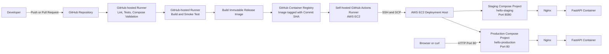
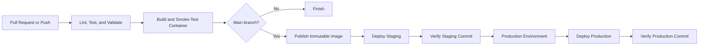

# HelloDeploy

[](https://github.com/akanksv/hello-deploy/actions/workflows/pipeline.yml)

A containerized **Hello World** web application with automated testing, immutable image publishing, staged deployment, production promotion, health verification, rollback support, monitoring endpoints, and Terraform-based infrastructure management.

## Quick Links

- [GitHub Repository](https://github.com/akanksv/hello-deploy)
- [CI/CD Workflow](https://github.com/akanksv/hello-deploy/actions/workflows/pipeline.yml)
- [Production Application](http://13.50.21.171)
- [Production Health](http://13.50.21.171/health)
- [Production Readiness](http://13.50.21.171/ready)
- [Production Version](http://13.50.21.171/version)
- [Production Metrics](http://13.50.21.171/metrics)
- [Architecture](#architecture)
- [CI/CD Pipeline](#cicd-pipeline)
- [Docker Setup](#docker-setup)
- [Local Development](#local-development)
- [Deployment](#deployment)
- [Infrastructure as Code](#infrastructure-as-code)
- [Security Considerations](#security-considerations)
- [Troubleshooting](#troubleshooting)
- [Implementation Coverage](#implementation-coverage)

> The production links are available only while the AWS EC2 instance is running.

---

## 1. Project Overview

HelloDeploy is a deployment engineering project built around a deliberately small FastAPI service. The application remains simple by design so that the repository can focus on reproducible builds, release traceability, staged promotion, automated verification, operational visibility, and recovery behavior.

The project implements:

- A FastAPI web application that returns **Hello World**
- Docker-based application packaging
- Docker Compose orchestration
- Nginx reverse proxying
- Automated linting, testing, Compose validation, and container smoke testing
- Immutable Docker image publishing to GitHub Container Registry
- Separate staging and production deployments
- SSH-based automated deployment to an AWS EC2 instance
- Health, readiness, version, and Prometheus metrics endpoints
- Automatic rollback to the previous healthy release
- Infrastructure management with Terraform
- A self-hosted GitHub Actions runner on the deployment server

The repository is available at:

```text
https://github.com/akanksv/hello-deploy
```

---

## 2. Engineering Goals

The implementation is designed around the following engineering goals:

1. Package the application in a reproducible container image.
2. Validate application code and deployment configuration automatically.
3. Build and test the real container before publication.
4. Publish every release with an immutable Git commit SHA tag.
5. Deploy the same image first to staging and then to production.
6. Verify that the deployed version matches the triggering commit.
7. Restore the previous release automatically if a new deployment is unhealthy.
8. Store infrastructure configuration as code.
9. Keep credentials outside the repository.
10. Provide observable health and metrics endpoints.

---

## 3. Technology Stack

| Area | Technology |
|---|---|
| Application | Python 3.12, FastAPI, Uvicorn |
| Testing | Pytest, HTTPX |
| Linting | Ruff |
| Containerization | Docker |
| Orchestration | Docker Compose |
| Reverse proxy | Nginx |
| CI/CD | GitHub Actions |
| Container registry | GitHub Container Registry |
| Deployment host | AWS EC2, Ubuntu/Linux |
| Infrastructure as Code | Terraform |
| Monitoring | Prometheus client metrics |
| Deployment transport | SSH and SCP |
| Version identification | Git commit SHA |

---

## 4. Architecture



### Deployment environments

| Environment | Compose project | Host port | Public access | Verification URL |
|---|---|---:|---|---|
| Staging | `hello-staging` | `8080` | Not publicly exposed | `http://127.0.0.1:8080` |
| Production | `hello-production` | `80` | Public | `http://127.0.0.1:80` |

Deployment jobs execute on a Linux self-hosted runner installed on the EC2 host. The release procedure still uses SSH and SCP, which keeps deployment responsibilities explicit and preserves the same deployment contract if the runner and target host are separated in a future architecture.

---

## 5. Repository Structure

```text
.
├── .github/
│   └── workflows/
│       └── pipeline.yml
├── app/
│   ├── __init__.py
│   └── main.py
├── deploy/
│   ├── deploy.sh
│   └── nginx.conf
├── infrastructure/
│   ├── .terraform.lock.hcl
│   ├── ec2.tf
│   ├── imports.tf
│   ├── providers.tf
│   └── versions.tf
├── tests/
│   └── test_app.py
├── .dockerignore
├── .env.example
├── .gitattributes
├── .gitignore
├── compose.local.yml
├── compose.yml
├── Dockerfile
├── pyproject.toml
├── requirements-dev.txt
└── requirements.txt
```

| File or directory | Purpose |
|---|---|
| `app/main.py` | FastAPI application and operational endpoints |
| `tests/test_app.py` | Automated endpoint tests |
| `Dockerfile` | Multi-stage production image |
| `compose.yml` | Production-style application and Nginx services |
| `compose.local.yml` | Local image build override |
| `deploy/deploy.sh` | Deployment, health verification, and rollback logic |
| `deploy/nginx.conf` | Reverse proxy configuration |
| `.github/workflows/pipeline.yml` | Complete CI/CD pipeline |
| `infrastructure/` | Terraform configuration for the AWS EC2 instance |
| `.env.example` | Example runtime configuration |
| `.dockerignore` | Files excluded from Docker build context |
| `.gitignore` | Local, secret, generated, and Terraform state exclusions |

---

## 6. Application Endpoints

| Endpoint | Purpose | Expected result |
|---|---|---|
| `/` | Human-readable application page | HTML page containing `Hello World!` |
| `/health` | Liveness and deployment health | `{"status":"healthy"}` |
| `/ready` | Readiness verification | `{"status":"ready"}` |
| `/version` | Deployment proof | Environment, commit SHA, build time, and current time |
| `/metrics` | Prometheus-compatible metrics | Request counters and deployment information |

Example production checks:

```bash
curl --fail http://13.50.21.171/health
curl --fail http://13.50.21.171/ready
curl --fail http://13.50.21.171/version
curl --fail http://13.50.21.171/metrics
```

The `version` field is injected into the image at build time and is used by the pipeline to prove that the expected commit was deployed.

---

## 7. Docker Setup

### 7.1 Dockerfile

The Dockerfile uses a multi-stage build:

1. The builder stage creates a virtual environment and installs Python dependencies.
2. The runtime stage copies only the virtual environment and application source.
3. The application runs as the non-root user `appuser`.
4. The Git commit SHA and build time are stored as image metadata and environment variables.
5. A container-level health check calls the application health endpoint.

Important production characteristics:

- Python 3.12 slim base image
- Non-root runtime user
- Minimal runtime content
- Built-in health check
- OCI image metadata
- No development dependencies in the production image

### 7.2 Docker Compose

`compose.yml` defines two services:

#### `app`

- Runs the immutable application image
- Exposes port `8000` only to the internal Compose network
- Uses an application health check
- Uses a read-only filesystem
- Uses a temporary filesystem for `/tmp`
- Enables `no-new-privileges`
- Limits Docker JSON log file size and retention

#### `proxy`

- Uses `nginx:1.27-alpine`
- Waits for the application service to become healthy
- Maps the configured host port to container port `80`
- Proxies requests to `app:8000`
- Uses a read-only Nginx configuration mount
- Enables `no-new-privileges`
- Applies log rotation

Both services communicate through a dedicated bridge network named `application`.

---

## 8. Local Development

### Prerequisites

- Git
- Docker Engine or Docker Desktop
- Docker Compose v2
- Python 3.12 for direct test execution

### Clone and configure

```bash
git clone https://github.com/akanksv/hello-deploy.git
cd hello-deploy
cp .env.example .env
```

PowerShell equivalent:

```powershell
Copy-Item .env.example .env
```

### Start locally

```bash
docker compose   -f compose.yml   -f compose.local.yml   up --build --detach
```

The application is then available at:

```text
http://127.0.0.1:8080
```

### Verify locally

```bash
curl --fail http://127.0.0.1:8080/health
curl --fail http://127.0.0.1:8080/ready
curl --fail http://127.0.0.1:8080/version
```

### View status and logs

```bash
docker compose -f compose.yml -f compose.local.yml ps
docker compose -f compose.yml -f compose.local.yml logs --follow
```

### Stop locally

```bash
docker compose -f compose.yml -f compose.local.yml down
```

---

## 9. Local Quality Checks

```bash
python -m venv .venv
```

Bash or Git Bash:

```bash
source .venv/bin/activate
```

PowerShell:

```powershell
.venv\Scripts\Activate.ps1
```

Install dependencies and run checks:

```bash
python -m pip install --upgrade pip
pip install -r requirements.txt -r requirements-dev.txt
ruff check app tests
pytest --verbose
cp .env.example .env
docker compose -f compose.yml -f compose.local.yml config --quiet
```

---

## 10. CI/CD Pipeline

The workflow is defined in:

```text
.github/workflows/pipeline.yml
```

### Triggers

The workflow runs on:

- Every pull request
- Every push to `main`
- Manual execution through `workflow_dispatch`

Pull requests perform validation and container testing but do not publish or deploy release images.

### Pipeline stages



#### Stage 1: Lint, test, and validate

Runs on a GitHub-hosted Ubuntu runner and performs dependency installation, Ruff linting, Pytest execution, and Docker Compose validation.

#### Stage 2: Build and smoke-test container

Builds a real container, starts it, checks `/health`, verifies `/version`, compares the reported version with `GITHUB_SHA`, collects logs after failure, and removes the test container.

#### Stage 3: Publish immutable image

Runs only for `main` and publishes:

```text
ghcr.io/akanksv/hello-deploy:${GITHUB_SHA}
```

The commit SHA is the immutable release tag.

#### Stage 4: Deploy staging

Runs on the self-hosted Linux runner. It prepares SSH credentials, validates the host key, tests SSH access, transfers deployment files, deploys `hello-staging`, verifies health, and confirms the expected commit through `http://127.0.0.1:8080`.

#### Stage 5: Deploy production

Runs after staging succeeds. It deploys the same immutable image to `hello-production` and verifies the expected commit through `http://127.0.0.1:80`.

The GitHub `production` environment can be configured with required reviewers so deployment pauses for approval.

### Concurrency

Workflow concurrency prevents uncontrolled parallel execution for the same Git reference. Production also uses a dedicated concurrency group to prevent overlapping production deployments.

---

## 11. GitHub Configuration

### Environments

- `staging`
- `production`

### Required environment secrets

| Secret | Purpose |
|---|---|
| `SSH_PRIVATE_KEY` | Private key used by the deployment job |
| `SSH_KNOWN_HOSTS` | Trusted SSH host key entry |
| `SSH_USER` | Remote deployment user |
| `SSH_HOST` | Deployment host address |

### Required environment variables

#### Staging

| Variable | Value or purpose |
|---|---|
| `APPLICATION_URL` | `http://127.0.0.1:8080` |
| `FORCE_UNHEALTHY` | Normally `false`; may be set to `true` for rollback demonstration |

#### Production

| Variable | Value or purpose |
|---|---|
| `APPLICATION_URL` | `http://127.0.0.1:80` |

The loopback addresses are intentional. The self-hosted runner is installed on the EC2 host, so verification is independent of the developer's router, location, or public IP.

---

## 12. Deployment

### Normal deployment process

1. Develop a change on a feature branch.
2. Open a pull request.
3. Wait for linting, tests, Compose validation, and container smoke testing.
4. Review and merge into `main`.
5. Build and publish a release image tagged with the merge commit SHA.
6. Deploy the image to staging.
7. Verify staging health and commit identity.
8. Approve production when environment protection is enabled.
9. Deploy the same image to production.
10. Verify production health and commit identity.

### Deployment directories

```text
/opt/hello-deploy/staging
/opt/hello-deploy/production
```

Each environment has an independent Compose project, `.env`, `.env.previous`, and deployment directory.

### Manual verification on the EC2 host

```bash
curl --fail http://127.0.0.1:8080/health
curl --fail http://127.0.0.1:8080/version
curl --fail http://127.0.0.1:80/health
curl --fail http://127.0.0.1:80/version
```

### Public production verification

```bash
curl --fail http://13.50.21.171/health
curl --fail http://13.50.21.171/version
```

Port `8080` is intentionally not publicly exposed.

---

## 13. Rollback Strategy

Rollback logic is implemented in `deploy/deploy.sh`.

Before deployment, the current `.env` file is copied to `.env.previous`. The script then writes the candidate configuration, pulls the candidate image, recreates the services, and waits for the application container to become healthy.

If the candidate remains unhealthy, the script restores `.env.previous`, recreates the previous release, verifies its health, and returns a failure status so the pipeline records the failed candidate deployment.

### Rollback demonstration

Set the staging environment variable to:

```text
FORCE_UNHEALTHY=true
```

The candidate health endpoint returns HTTP `503`, causing the script to attempt restoration of the previous healthy release. After the demonstration, reset the variable to:

```text
FORCE_UNHEALTHY=false
```

Production always uses `FORCE_UNHEALTHY=false`.

---

## 14. Monitoring and Logging

| Capability | Endpoint or mechanism |
|---|---|
| Liveness | `/health` |
| Readiness | `/ready` |
| Deployment identity | `/version` |
| Prometheus metrics | `/metrics` |
| Container logs | Docker `json-file` driver |
| Log rotation | `10m` maximum size, `3` files |

Example log commands:

```bash
docker compose   --project-name hello-staging   --file /opt/hello-deploy/staging/compose.yml   logs --tail=100
```

```bash
docker compose   --project-name hello-production   --file /opt/hello-deploy/production/compose.yml   logs --tail=100
```

---

## 15. Infrastructure as Code

Terraform configuration is stored in `infrastructure/`.

This directory defines the AWS provider and the EC2 deployment host declaratively. The configuration captures the host characteristics required by the application platform and applies lifecycle protection to reduce the risk of accidental destruction.

| Item | Configuration |
|---|---|
| Provider | AWS |
| Region | `eu-north-1` |
| Availability Zone | `eu-north-1b` |
| Instance type | `t3.micro` |
| Production public address | `13.50.21.171` |
| Root volume | 8 GiB `gp3` |
| Instance metadata | IMDSv2 required |

The EC2 resource includes:

```hcl
lifecycle {
  prevent_destroy = true
}
```

### Terraform commands

```bash
cd infrastructure
terraform init
terraform fmt -check
terraform validate
terraform plan
```

Apply only after reviewing the plan:

```bash
terraform apply
```

### Terraform state

Terraform state is excluded from Git through `.gitignore`. The current implementation uses local state, so reliable infrastructure operations depend on preserving the correct state file securely.

For collaborative or long-lived operation, the state should be migrated to a secured remote backend with locking, versioning, restricted access, and recovery controls.

---

## 16. Security Considerations

### Implemented controls

- Default GitHub Actions permission is `contents: read`
- Package write permission is limited to the image publication job
- Deployment credentials are stored as GitHub environment secrets
- Strict SSH host key checking is enabled
- Temporary SSH key files are deleted after deployment
- Images use immutable commit SHA tags
- The application runs as a non-root user
- Containers use `no-new-privileges`
- The application container uses a read-only filesystem
- Docker logs are rotated
- Staging port `8080` is not publicly exposed
- Terraform state is excluded from source control
- EC2 metadata requires IMDSv2
- Terraform uses `prevent_destroy`
- Production follows successful staging verification

### Known limitations and trade-offs

1. **HTTP only:** HTTPS is not yet configured.
2. **SSH exposure:** Port `22` is publicly reachable. AWS Systems Manager, a VPN, or a restricted network path would be stronger.
3. **Single host:** Staging, production, and the self-hosted runner share one EC2 instance.
4. **Local Terraform state:** Collaboration requires secure state sharing or a remote backend.
5. **Unencrypted root volume:** The root EBS volume is not encrypted.
6. **Public metrics:** `/metrics` is reachable through production and should be protected in a stricter environment.
7. **No high availability:** There is no load balancer, auto scaling, or multi-zone redundancy.

---

## 17. Troubleshooting

### Workflow waits for a self-hosted runner

The EC2 instance or runner is offline. Start the instance and confirm the Linux x64 runner is online under **Settings → Actions → Runners**.

### Staging reports the production environment

Set:

```text
staging APPLICATION_URL = http://127.0.0.1:8080
production APPLICATION_URL = http://127.0.0.1:80
```

### External access to port 8080 fails

This is expected. Staging is internal. Test it on the EC2 host:

```bash
curl --fail http://127.0.0.1:8080/health
```

### Version verification fails

Check `/version`, the image tag in `.env`, and the running container image:

```bash
docker ps --format 'table {{.Names}}\t{{.Image}}\t{{.Status}}'
```

Confirm that each environment uses the correct `APPLICATION_URL`.

### SSH connection fails

Check `SSH_HOST`, `SSH_USER`, `SSH_PRIVATE_KEY`, `SSH_KNOWN_HOSTS`, EC2 status, the security group, and the SSH service.

### Candidate release is unhealthy

Review Compose logs, confirm image availability and variables, check `/health`, and verify whether the rollback restored the previous image.

### Terraform reports unexpected changes

Do not apply the plan. Confirm the active AWS account, region, state file, and configuration, then compare the proposed changes with the intended infrastructure. Back up state before any state repair or reconciliation.

---

## 18. Operational Commands

### Production checks from an external machine

```bash
curl --fail http://13.50.21.171/health
curl --fail http://13.50.21.171/ready
curl --fail http://13.50.21.171/version
```

### Staging checks from the EC2 host

```bash
curl --fail http://127.0.0.1:8080/health
curl --fail http://127.0.0.1:8080/version
```

### Container status

```bash
docker ps
```

### Staging status

```bash
cd /opt/hello-deploy/staging
docker compose --project-name hello-staging ps
```

### Production status

```bash
cd /opt/hello-deploy/production
docker compose --project-name hello-production ps
```

When the EC2 instance is stopped, the application, staging environment, and self-hosted runner are unavailable. The associated Elastic IP remains unchanged after restart.

---

## 19. Project Requirements and Corresponding Implementation

| Capability area | Corresponding implementation |
|---|---|
| Delivery architecture | GitHub Actions, GitHub Container Registry, AWS EC2, and distinct staging and production release paths |
| Container image construction | Multi-stage Python image with a non-root runtime user and embedded release metadata |
| Multi-service runtime | Docker Compose defines the application, Nginx proxy, isolated network, health checks, security controls, and log rotation |
| Repository automation | GitHub provides source control, pull request validation, workflow execution, environment controls, and release history |
| Automated build | Reproducible test and release images are built directly from repository contents |
| Automated verification | Ruff, Pytest, Compose validation, and real-container smoke testing run before release publication |
| Execution environments | GitHub-hosted runners perform validation, while a self-hosted Linux runner performs controlled deployment |
| Remote release transport | SSH validates connectivity, SCP transfers release files, and the deployment script applies the release |
| Service reconciliation | Docker Compose recreates services and removes obsolete containers during deployment |
| External availability | The production service is reachable through the EC2 Elastic IP on port 80 |
| Credential protection | SSH credentials and host verification data are stored in GitHub environment secrets |
| Configuration management | Runtime settings are supplied through `.env` files, GitHub variables, and deployment-time environment values |
| Release reproducibility | Slim multi-stage images are tagged with the exact Git commit SHA |
| Runtime health control | Health checks are enforced in the application, image, Compose stack, deployment script, and CI/CD workflow |
| Recovery behavior | Failed candidate releases trigger restoration and verification of the previous healthy configuration |
| Observability | Prometheus-compatible metrics, version metadata, health endpoints, and rotated container logs are available |
| Environment isolation | Staging and production use independent Compose projects, ports, directories, and GitHub environments |
| Declarative infrastructure | Terraform records the EC2 deployment host, provider constraints, lifecycle protection, and repeatable planning commands |
| Operational diagnosis | The documentation includes failure symptoms, likely causes, verification commands, and recovery actions |

---

## 20. Conclusion

HelloDeploy presents a complete and auditable release path for a small web service. It integrates container construction, automated validation, immutable release identification, staged promotion, SSH-based deployment, runtime verification, rollback handling, operational metrics, security hardening, and declarative infrastructure management.

The current single-instance topology keeps the system economical and understandable while preserving the essential controls of a disciplined delivery process. A production-scale evolution would add HTTPS, centrally managed Terraform state, encrypted storage, private administration through AWS Systems Manager or a controlled network path, separation of runner and workload hosts, and high-availability infrastructure.
